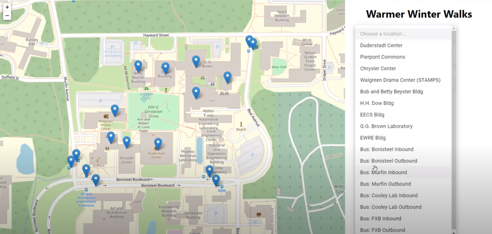
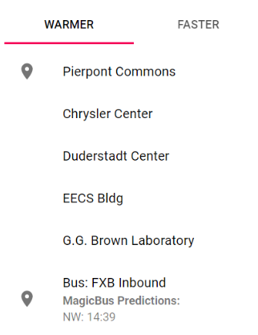
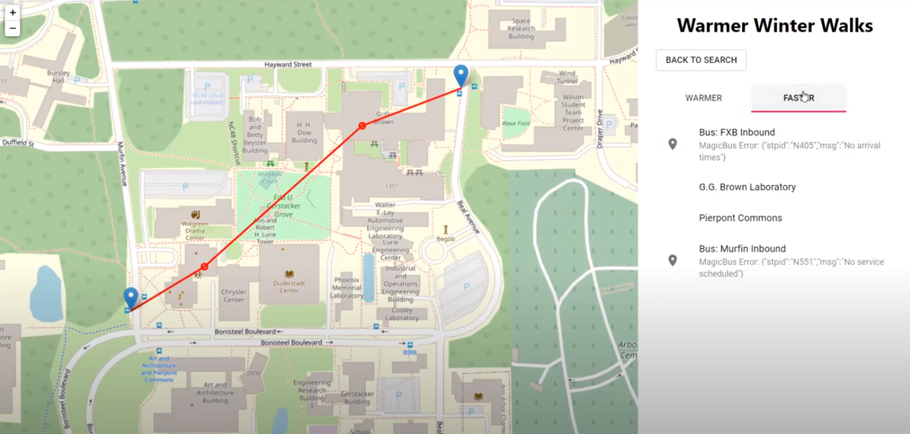

# Warmer Winter Walks

By Ben Manley, Montana Mott, and Mackenzie Roberts 
as a final project for UMich's EECS 493 (User Interface Development).

Warmer Winter Walks is an interactive map application that provides routes between locations on Michigan's North Campus that minimizes time walking outside, so everyone can have warmer winter walks!

Built as a [React App](https://reactjs.org/), with [React Leaflet](https://react-leaflet.js.org/) rendering [OpenStreetMap](https://www.openstreetmap.org/) for our map and [MaterialUI](https://material-ui.com/) supporting the display.

User interface was prioritized (as per the class this project was produced for), so the number of locations were limited to those around the North Campus Grove for simplicity.

## Display Screenshots

Here you can see the front page of the application. The search panel is on the right, and on the map you can see Leaflet's clickable markers (with location-name Popups).

Users select their starting and ending points (and an optional intermediate stop) from dropdown menus.

Upon clicking *Submit*, users reach the results page. Here you can see the drawn route on the left and the itemized list on the right. Also note the popup on the left as a result of hovering over a list item on the right. Because of the Coronavirus pandemic, buses were rarely running - hence the MagicBus errors on the bus stops.

If a user provides a bus stop as a starting point or destination, Michigan's MagicBus is used to display bus time predictions. Here is what a successful MagicBus API call leads to.

We also display the fastest route between two locations, for users who prioritize time over warmth.

